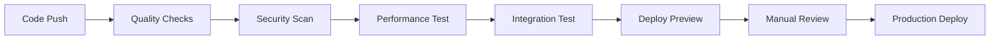

# 🛡️ Quality Gates Implementation Guide

## 🎯 Overview

Quality gates ensure consistent code quality, security, and performance standards across the Dixis platform. This guide documents our automated quality control measures.

## 🔄 CI/CD Pipeline Overview

### **Trigger Events**
- **Pull Request**: Full quality validation
- **Push to develop**: Integration testing
- **Push to main**: Production deployment
- **Tagged release**: Full production release

### **Pipeline Stages**


## 🧪 Quality Check Categories

### **1. Code Quality**
- **ESLint/Prettier**: Frontend code formatting and standards
- **PHP CodeSniffer**: Backend PSR-12 compliance
- **TypeScript**: Strict type checking
- **Unit Tests**: 85%+ coverage requirement

### **2. Security Scanning**
- **Trivy**: Vulnerability scanning for dependencies
- **npm audit**: Frontend security audit
- **composer audit**: Backend security audit
- **SAST**: Static application security testing

### **3. Performance Validation**
- **Bundle size limits**: <500KB frontend bundle
- **Lighthouse CI**: Performance, accessibility, SEO scores
- **Load testing**: API response time validation
- **Core Web Vitals**: User experience metrics

### **4. Business Logic Testing**
- **Unit tests**: Individual component testing
- **Integration tests**: API endpoint validation
- **E2E tests**: Critical user journey testing
- **Smoke tests**: Production health validation

## 📏 Quality Standards

### **Frontend Standards**
```typescript
// Code Quality Thresholds
const qualityGates = {
  bundleSize: '500KB',
  lighthouse: {
    performance: 90,
    accessibility: 95,
    bestPractices: 90,
    seo: 95
  },
  testCoverage: 85,
  typeScriptStrict: true
}
```

### **Backend Standards**
```php
// Quality Requirements
[
    'test_coverage' => 85,
    'psr12_compliance' => 100,
    'response_time' => '<200ms',
    'error_rate' => '<0.1%'
]
```

### **Security Standards**
- **No critical vulnerabilities** in dependencies
- **Authentication required** for all sensitive endpoints
- **Rate limiting** on public APIs
- **HTTPS only** in production
- **Secret scanning** prevents credential commits

## 🚫 Blocking Conditions

### **PR Cannot Merge If:**
- [ ] Any CI check fails
- [ ] Test coverage below 85%
- [ ] Security vulnerabilities found
- [ ] PR size > 500 lines (without justification)
- [ ] Missing required labels
- [ ] No linked issue
- [ ] Failed code review

### **Production Deployment Blocked If:**
- [ ] Critical bugs in main branch
- [ ] Security vulnerabilities
- [ ] Performance regression
- [ ] Missing environment secrets
- [ ] Failed smoke tests

## 🏷️ PR Size Guidelines

### **Size Categories**
- **XS (1-10 lines)**: Trivial fixes, documentation
- **S (11-50 lines)**: Small bug fixes, minor features
- **M (51-200 lines)**: Medium features, refactoring
- **L (201-500 lines)**: Large features (needs justification)
- **XL (500+ lines)**: Requires breaking into smaller PRs

### **Large PR Approval Process**
1. **Technical justification** required in PR description
2. **Architecture review** by senior developer
3. **Additional testing** requirements
4. **Staged deployment** consideration

## 🔒 Branch Protection Rules

### **Main Branch Protection**
- ✅ Require pull request reviews (1 reviewer minimum)
- ✅ Require status checks to pass
- ✅ Require branches to be up to date
- ✅ Require conversation resolution
- ✅ Restrict pushes that create files larger than 100MB
- ✅ Restrict force pushes
- ✅ Restrict deletions

### **Develop Branch Protection**
- ✅ Require pull request reviews (1 reviewer minimum)
- ✅ Require status checks to pass
- ✅ Allow force pushes for maintainers
- ✅ Require conversation resolution

## 📊 Quality Metrics Dashboard

### **Weekly Quality Report**
```typescript
interface QualityMetrics {
  testCoverage: number          // Target: >85%
  bugEscapeRate: number        // Target: <5%
  deploymentFrequency: number  // Target: Daily
  leadTime: number             // Target: <3 days
  changeFailureRate: number    // Target: <10%
  recoveryTime: number         // Target: <1 hour
}
```

### **Code Review Metrics**
- **Review time**: Target <24 hours
- **Approval rate**: Track first-time vs. revision approvals
- **Review participation**: Ensure knowledge sharing
- **Feedback quality**: Constructive, educational reviews

## 🚀 Deployment Gates

### **Staging Deployment**
- ✅ All CI checks pass
- ✅ Feature branch merged to develop
- ✅ Integration tests pass
- ✅ Database migrations validated

### **Production Deployment**
- ✅ Staging validation complete
- ✅ Business approval for release
- ✅ Database backup created
- ✅ Rollback plan confirmed
- ✅ Monitoring alerts configured

## 🔧 Tool Configuration

### **Package.json Scripts**
```json
{
  "scripts": {
    "lint": "eslint . --ext .ts,.tsx",
    "lint:fix": "eslint . --ext .ts,.tsx --fix",
    "format": "prettier --write .",
    "format:check": "prettier --check .",
    "test:unit": "jest",
    "test:e2e": "playwright test",
    "test:coverage": "jest --coverage",
    "build": "next build",
    "analyze": "ANALYZE=true next build"
  }
}
```

### **Composer Scripts**
```json
{
  "scripts": {
    "test": "phpunit",
    "test:coverage": "phpunit --coverage-html coverage",
    "cs:check": "phpcs --standard=PSR12 app/",
    "cs:fix": "phpcbf --standard=PSR12 app/",
    "analyze": "phpstan analyse app/ --level=8"
  }
}
```

## 📈 Continuous Improvement

### **Monthly Quality Review**
1. **Metrics analysis**: Review quality trends
2. **Tool evaluation**: Assess effectiveness of quality gates
3. **Process refinement**: Update standards based on learnings
4. **Team feedback**: Gather developer experience insights

### **Quality Gate Evolution**
- **Gradual tightening**: Increase standards over time
- **Tool adoption**: Integrate new quality tools
- **Custom rules**: Add domain-specific validations
- **Performance optimization**: Balance thoroughness with speed

## 🚨 Emergency Procedures

### **Quality Gate Override**
In critical production issues, quality gates can be bypassed with:
- **Senior developer approval**
- **Incident documentation**
- **Follow-up issue creation**
- **Post-incident review**

### **Rollback Triggers**
Automatic rollback initiated if:
- Error rate > 5% for 5 minutes
- Response time > 5 seconds
- Critical user flows failing
- Payment processing issues

## 📚 Developer Training

### **New Developer Onboarding**
1. **Quality standards overview**
2. **Tool setup and configuration**
3. **PR workflow training**
4. **Code review best practices**

### **Ongoing Education**
- **Weekly tech talks** on quality practices
- **Code review workshops**
- **Security awareness training**
- **Performance optimization techniques**

---

**Implementation Status**: ✅ Phase 4 Complete - Quality gates and automation implemented

**Next Actions**: Deploy to GitHub, train team on new workflows, monitor effectiveness