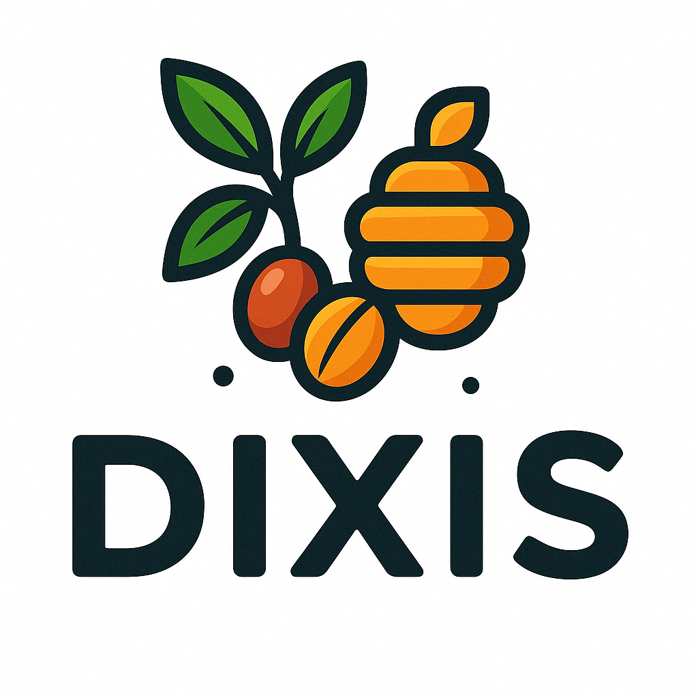

# Dixis Fresh - Greek Agricultural Marketplace Platform 🌾



Dixis Fresh is a comprehensive B2B/B2C marketplace platform connecting Greek agricultural producers directly with consumers and businesses. Built with modern web technologies, it features a unique adoption system for agricultural products, Greek VAT compliance, SEPA payment integration, and full multi-tenant capabilities.

## 🚀 Key Features

### For Consumers
- **Direct Farm-to-Table Shopping**: Buy fresh produce directly from Greek farmers
- **Product Adoption System**: Adopt agricultural products and support local farmers
- **Multi-Producer Cart**: Order from multiple producers in a single transaction
- **Greek Regional Shipping**: Optimized shipping zones for mainland Greece and islands
- **Secure Payments**: Stripe integration with SEPA Direct Debit support

### For Producers
- **Producer Dashboard**: Comprehensive analytics and order management
- **Product Management**: Easy product listing with seasonal availability
- **Financial Reporting**: Automated invoicing and Greek VAT compliance
- **QuickBooks Integration**: Seamless accounting synchronization

### For Businesses (B2B)
- **Wholesale Pricing**: Volume-based discounts and bulk ordering
- **Business Accounts**: Dedicated B2B portal with custom pricing
- **API Integration**: RESTful API for system integration
- **Invoice Management**: Automated B2B invoicing with Greek tax compliance

### Platform Features
- **Multi-Tenant Architecture**: Support for multiple marketplace instances
- **Greek VAT System**: Full compliance with Greek tax regulations (24%, 13%, 6% rates)
- **EU Reverse Charge**: B2B transactions within EU
- **Real-time Monitoring**: Production-ready error handling and health monitoring
- **PWA Support**: Mobile-optimized with offline capabilities
- **Multi-language**: Greek and English support

## 🛠️ Technology Stack

### Frontend
- **Next.js 15**: React framework with App Router
- **TypeScript**: Type-safe development
- **Tailwind CSS**: Utility-first styling
- **React Query**: Data fetching and caching
- **Zustand**: State management

### Backend
- **Laravel**: PHP framework for API
- **MySQL**: Production database
- **Redis**: Caching and sessions
- **Stripe**: Payment processing
- **QuickBooks API**: Accounting integration

### Infrastructure
- **Docker**: Containerized deployment
- **Nginx**: Web server and reverse proxy
- **GitHub Actions**: CI/CD pipeline
- **Sentry**: Error tracking
- **CloudFlare**: CDN and DDoS protection

## 📋 Prerequisites

- Node.js 18+ and npm/yarn
- PHP 8.2+ with Composer
- MySQL 8.0+
- Redis 7+
- Docker & Docker Compose (for production deployment)

## 🚀 Quick Start

### Development Setup

1. **Clone the repository**
   ```bash
   git clone https://github.com/yourusername/dixis-fresh.git
   cd dixis-fresh
   ```

2. **Install frontend dependencies**
   ```bash
   npm install
   # or
   yarn install
   ```

3. **Setup environment variables**
   ```bash
   cp .env.example .env.local
   # Edit .env.local with your configuration
   ```

4. **Setup the backend**
   ```bash
   cd ../backend
   composer install
   cp .env.example .env
   php artisan key:generate
   ```

5. **Run database migrations**
   ```bash
   php artisan migrate
   php artisan db:seed # Optional: seed with demo data
   ```

6. **Start development servers**
   ```bash
   # Terminal 1 - Laravel backend
   cd backend
   php artisan serve --port=8000

   # Terminal 2 - Next.js frontend
   cd dixis-fresh
   npm run dev
   ```

7. **Access the application**
   - Frontend: http://localhost:3000
   - Backend API: http://localhost:8000/api

## 🐳 Production Deployment

### Using Docker Compose

1. **Prepare environment**
   ```bash
   cp .env.production.template .env.production
   # Update with production credentials
   ```

2. **Build and deploy**
   ```bash
   docker-compose -f docker-compose.production.yml up -d
   ```

3. **Run migrations**
   ```bash
   docker-compose exec app php artisan migrate --force
   ```

4. **Configure SSL**
   - Update Nginx configuration with SSL certificates
   - Enable HTTPS redirect

### Manual Deployment

See [docs/PRODUCTION_DATABASE_MIGRATION_PLAN.md](docs/PRODUCTION_DATABASE_MIGRATION_PLAN.md) for detailed deployment instructions.

## 📁 Project Structure

```
dixis-fresh/
├── src/
│   ├── app/              # Next.js app router pages
│   ├── components/       # React components
│   ├── lib/             # Utilities and services
│   ├── stores/          # Zustand state stores
│   └── styles/          # Global styles
├── public/              # Static assets
├── scripts/             # Build and deployment scripts
├── docs/                # Documentation
└── tests/               # Test suites

backend/
├── app/                 # Laravel application
├── database/            # Migrations and seeds
├── routes/              # API routes
└── storage/             # File storage
```

## 🧪 Testing

### Frontend Tests
```bash
npm run test
npm run test:e2e
```

### Backend Tests
```bash
cd backend
php artisan test
```

## 📊 Monitoring

The platform includes comprehensive monitoring:

- **Health Checks**: `/api/monitoring/health`
- **Error Dashboard**: Admin panel error monitoring
- **Performance Metrics**: Real-time performance tracking
- **Uptime Monitoring**: Service availability checks

## 🔐 Security

- SSL/TLS encryption for all communications
- CSRF protection on all state-changing operations
- Rate limiting on authentication endpoints
- Input sanitization and validation
- Regular security audits

## 🌍 Localization

Currently supported languages:
- 🇬🇷 Greek (primary)
- 🇬🇧 English

## 📝 API Documentation

API documentation is available at `/api/docs` when running in development mode.

Key endpoints:
- `GET /api/products` - List products
- `GET /api/producers` - List producers
- `POST /api/orders` - Create order
- `GET /api/auth/user` - Get authenticated user

## 🤝 Contributing

We welcome contributions! Please see our [Contributing Guide](CONTRIBUTING.md) for details.


## 📄 License

This project is proprietary software. All rights reserved.

## 🆘 Support

For support, please contact:
- Email: support@dixis.gr
- Documentation: [docs.dixis.gr](https://docs.dixis.gr)

## 🙏 Acknowledgments

- Greek agricultural producers for their feedback
- Open source community for the amazing tools
- All contributors who helped build this platform

---

Built with ❤️ for Greek agriculture 🌾🇬🇷
